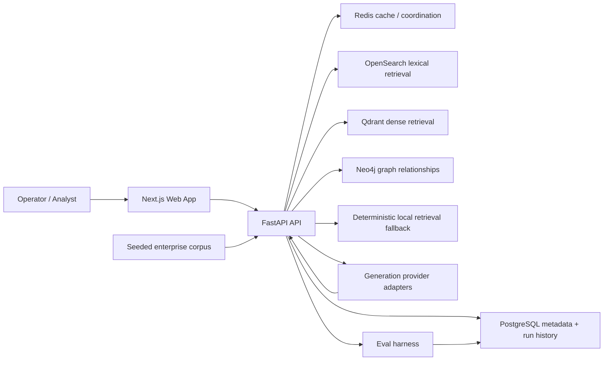
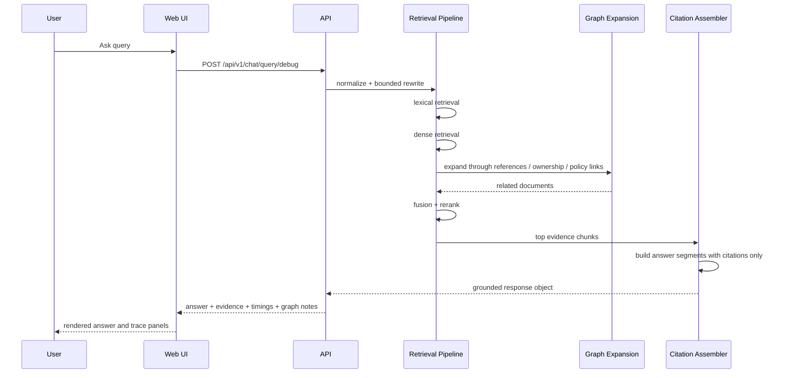
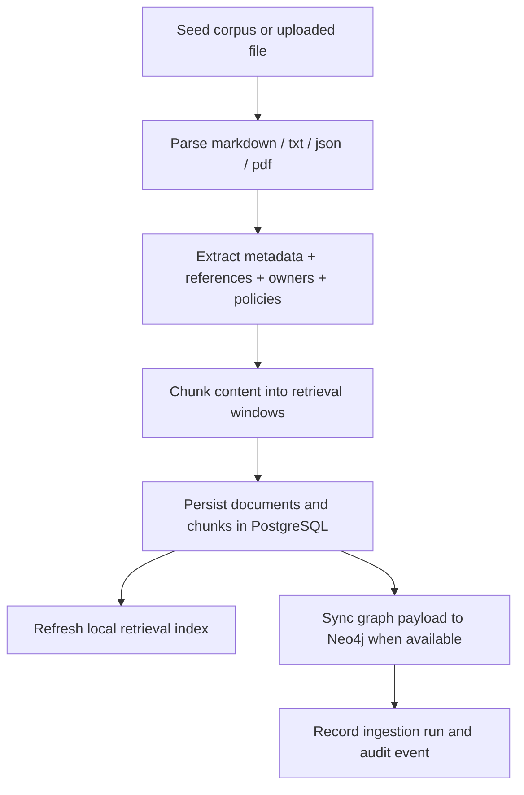
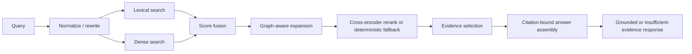
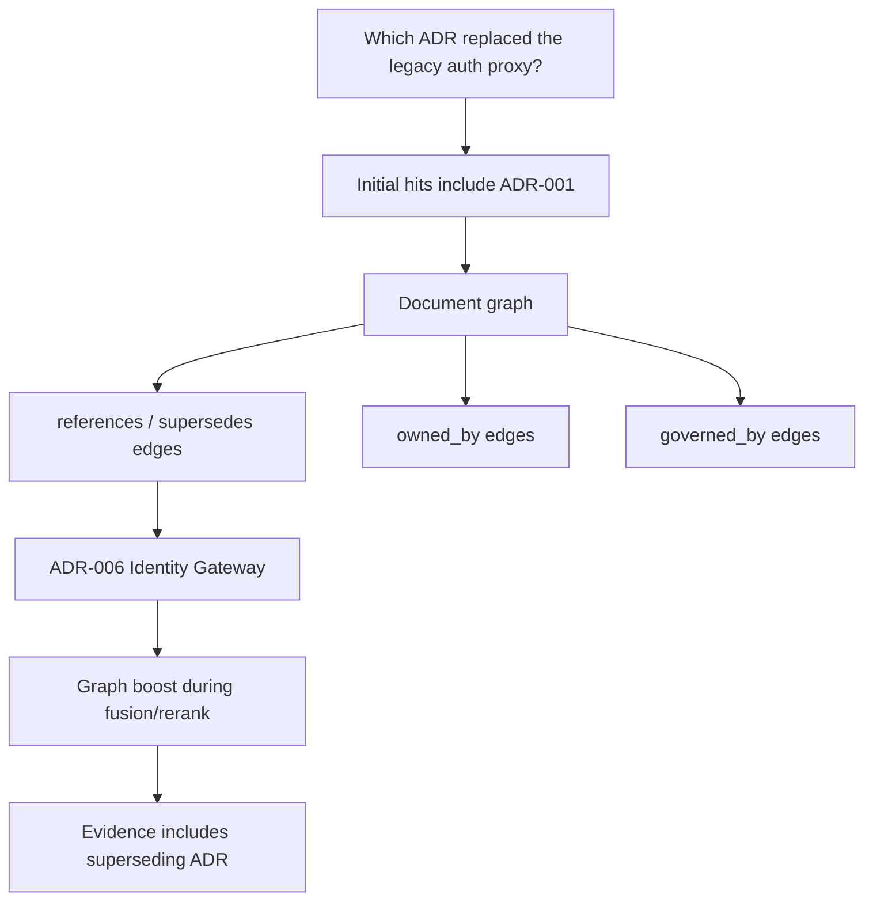
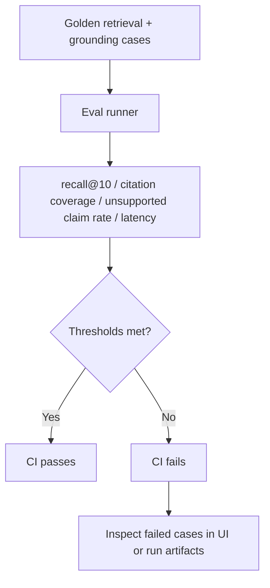
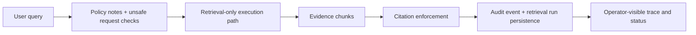

# CITADEL


<div align="center">


</div>

**Enterprise Retrieval Intelligence Platform** for internal document intelligence.

CITADEL is a production-minded “Ask My Docs” system built around a simple rule: if the platform cannot show evidence, it should not pretend the answer is grounded. The repository ships a full local stack with ingestion, chunking, hybrid retrieval, graph-aware expansion, reranking, citation-bound answer assembly, evaluation gates, health visibility, and a product-quality operator UI.

## Why CITADEL

Most internal knowledge bots stop at “semantic search + answer box.” That breaks down quickly once the corpus starts to look like an actual enterprise environment:

- ownership answers depend on policies, runbooks, and ADRs referencing each other
- incident questions need lexical precision and cross-document relationships
- governance-sensitive queries need an explicit insufficient-evidence mode
- operators need to inspect retrieval quality and dependency posture without diving into logs
- release quality needs eval gates, not intuition

CITADEL treats retrieval quality, evidence visibility, and governance posture as product requirements, not background plumbing.

## Feature Grid

| Capability | What is implemented |
| --- | --- |
| Ingestion | Seed and upload ingestion, markdown/txt/json parsing, PDF-capable parsing path, hashing, version metadata, chunking, ingestion runs |
| Retrieval | Query normalization, bounded rewrite, lexical + dense local retrieval, graph expansion, fusion, reranking |
| Grounding | Evidence-first answer assembly, chunk-level citations, unsupported-claim suppression, insufficient-evidence status |
| Graph | Real document-policy-system-team relationship graph with expansion hints and graceful degradation when Neo4j is unavailable |
| Product UI | Ask workbench, document library, ingestion console, eval dashboard, dependency status, public config visibility |
| Evaluation | Golden retrieval and grounding cases, eval runner, threshold-based pass/fail status, CI execution |
| Observability | Structured logging hooks, provider health persistence, retrieval timing traces, eval history |
| Governance | Audit events, RBAC-ready actor model, access-scope hooks, guardrail notes, design notes aligned to common governance frameworks |
| Portability | Docker Compose first, cloud mapping notes for AWS, Azure, and GCP |

## Product Surfaces

Generated UI previews below are derived from the implemented layout and component structure in `apps/web`.

| Ask | Dashboard |
| --- | --- |
|  |  |

| Ingestion | Status |
| --- | --- |
|  |  |

## System Architecture



### Runtime Shape

- `apps/web` renders the operator-facing experience.
- `apps/api` owns ingestion, retrieval, graph expansion, answer assembly, health checks, evals, and persistence.
- `datasets/sample_corpus` contains a realistic, cross-referenced corpus: platform runbooks, security playbooks, ADRs, onboarding manuals, privacy standards, and retention policies.
- Docker Compose provides the local service topology for Postgres, Redis, OpenSearch, Qdrant, Neo4j, API, and web.
- A deterministic local retrieval index keeps the platform functional when optional infrastructure is unavailable and keeps CI meaningful.

## Query Lifecycle



## Ingestion Lifecycle



## Retrieval, Rerank, and Grounding Flow



## Graph Expansion Path



## Eval Pipeline and CI Gate



## Security and Governance Control Flow



## Retrieval Strategy

### Hybrid Retrieval

- **Lexical retrieval** helps with exact policy names, doc IDs, explicit ownership language, and operational terms like “Severity 1” or “rollback.”
- **Dense retrieval** helps when the query uses different phrasing than the source documents.
- **Fusion** blends both channels before graph-aware expansion.

### Graph-Aware Expansion

The graph is not decorative. It captures document relationships such as:

- `references`
- `supersedes`
- `owned_by`
- `governed_by`
- `mentions`

That matters in enterprise corpora because the answer to “Which ADR replaced the legacy auth proxy?” is often not the most lexically similar document. It is the document that supersedes or references the older one.

### Reranking

The reranker uses a local cross-encoder when available. If that model is unavailable, the platform falls back to deterministic fusion-ordering and leaves that posture visible in provider status.

## Citation Enforcement

CITADEL keeps grounded delivery strict:

- answer segments are assembled only from retrieved evidence windows
- every rendered answer segment carries citations
- unsupported segments are suppressed instead of rendered as grounded
- insufficient evidence is a first-class response mode
- the Ask UI shows chunk evidence, source IDs, graph notes, and timings for the same run

This is intentionally stricter than an unconstrained answer generator. Fluency loses to provenance on purpose.

## Agentic Orchestration

CITADEL avoids theatrical “autonomous agent” framing. The current orchestration is bounded and explicit:

- query rewriting is retrieval-only and deterministic
- graph expansion is limited by hop count
- retrieval debugging exposes policy notes and graph effects
- no open-ended tool execution is allowed from the ask surface

The codebase leaves room for future workflow engines or LangGraph-style state nodes, but the current baseline keeps control logic inspectable and finite.

## Evaluation and Observability

### Eval posture

Seeded eval datasets live in `datasets/evals/` and include:

- retrieval target checks
- grounding checks
- disallowed claim checks

Thresholds currently enforced in the API configuration:

- `retrieval_recall_at_10 >= 0.80`
- `citation_coverage == 1.00`
- `unsupported_claim_rate <= 0.05`

### Operator visibility

- provider health is persisted in the relational store
- retrieval stage timings are returned per query
- eval runs are stored and surfaced in the UI
- audit events are persisted for retrieval and ingestion actions

## Security, Governance, and Responsible AI Posture

This repository does **not** claim certification or compliance. It does implement credible seams and notes for responsible deployment.

### Included design controls

- RBAC-ready actor model
- source-level access scope field on documents
- audit event persistence
- secret separation via environment configuration
- provider visibility without credential leakage
- bounded guardrail handling for unsafe queries
- evidence-first response posture for grounding-sensitive use cases

### Framework awareness

- **NIST AI RMF**: governance, measurement, and operator visibility are built into the runtime
- **ISO 42001 awareness**: control notes, evaluation processes, and monitoring seams exist in the repo
- **EU AI Act awareness**: provenance and bounded output matter more than model theatrics
- **SOC 2 mindset**: traceability, access boundaries, and change visibility are treated seriously
- **GDPR / HIPAA extensibility mindset**: privacy-aware storage and access hooks are included without pretending to be compliance out of the box

See:

- [Architecture overview](docs/architecture/overview.md)
- [Governance control notes](docs/governance/control-notes.md)
- [Threat model notes](docs/threat-model/maestro-linddun.md)
- [System tradeoffs](docs/decisions/system-tradeoffs.md)

## API Overview

| Route | Purpose |
| --- | --- |
| `GET /health` | base service health |
| `GET /health/dependencies` | dependency health for database, cache, search, graph, reranker, and generation posture |
| `GET /health/readiness` | readiness and indexed-document signal |
| `POST /api/v1/chat/query` | grounded query execution |
| `POST /api/v1/chat/query/debug` | query execution with trace visibility |
| `POST /api/v1/ingest/upload` | upload and ingest a file |
| `POST /api/v1/ingest/reindex` | rebuild indexes from the corpus |
| `GET /api/v1/documents` | document inventory |
| `GET /api/v1/documents/{id}` | document metadata and chunks |
| `GET /api/v1/documents/{id}/chunks` | chunk list for source inspection |
| `GET /api/v1/retrieval/runs/{id}` | retrieval run detail |
| `GET /api/v1/evals` | eval history |
| `POST /api/v1/evals/run` | execute evaluation profile |
| `GET /api/v1/evals/{id}` | eval detail |
| `GET /api/v1/providers` | provider and dependency posture |
| `GET /api/v1/config/public` | safe public runtime config |

## Sample Prompts

- What is the incident escalation policy for severity 1 outages?
- Which team owns the deployment rollback runbook?
- How does contractor onboarding differ from employee onboarding?
- Which ADR replaced the legacy auth proxy?
- What documents mention data retention exceptions?
- Which policy governs privileged production access?

## Local Setup

### Prerequisites

- Docker
- Python 3.11+
- Node 20+

### Bootstrap

```bash
cp .env.example .env
./scripts/bootstrap/bootstrap.sh
```

### Run with Docker Compose

```bash
docker compose up --build
```

Then open:

- Web UI: `http://localhost:3000`
- API docs: `http://localhost:8000/docs`

### Useful local commands

```bash
make api-test
make eval
make web-build
make seed
```

## Repository Shape

```text
citadel/
├── apps/
│   ├── api/         # FastAPI app, retrieval pipeline, evals, tests, migrations
│   └── web/         # Next.js App Router UI
├── datasets/        # Seed corpus and eval cases
├── docs/            # Architecture, governance, threat model, runbooks, assets
├── infra/           # Dockerfiles, CI workflow, terraform reference seams
├── packages/        # Shared UI, config, TS types, schemas, prompt assets
└── scripts/         # Bootstrap and runtime helper scripts
```

## Cloud Portability Notes

The implemented local path is Docker Compose first. The repo also includes cloud mapping notes for:

- AWS
- Azure
- GCP

Those notes are intentionally reference-grade, not fake multi-cloud IaC claims. See `infra/terraform/environments/*`.

## Tradeoffs

| Tradeoff | Decision |
| --- | --- |
| OpenSearch + vector + graph complexity vs simplicity | Keep the seams visible because enterprise retrieval quality often needs all three, but maintain a deterministic local fallback for CI and degraded mode |
| Local-first models vs managed providers | Default to deterministic extractive assembly; provider adapters are visible but not required for grounded baseline behavior |
| Workflow engine vs handwritten orchestration | Keep the current orchestration explicit and bounded; there is not enough payoff yet to justify a heavier agent graph runtime |
| Citation strictness vs answer fluency | Favor provenance and insufficient-evidence handling over smoother but riskier freeform output |
| Eval gates vs developer velocity | Let eval thresholds block regressions; quality gates are part of the product contract |
| Graph expansion vs latency budget | Bound graph hops and surface timings directly in the response |
| Docker Compose vs production orchestration depth | Optimize for a credible local stack while keeping cloud mapping seams documented instead of pretending production IaC is finished |
| Governance overhead vs shipping speed | Build governance hooks into the base architecture so they do not become retrofits later |

## Roadmap

The baseline is complete enough to run and inspect locally. The next serious upgrades would be:

1. Service-mode indexing and retrieval adapters wired fully to OpenSearch and Qdrant in the live request path.
2. Provider-backed structured generation with citation token validation, not just extractive assembly.
3. Real auth and document-level access enforcement at query time.
4. Richer eval suites with adversarial retrieval and permission-boundary cases.
5. Experiment tracking integration for retrieval tuning and model comparisons.

## License

Apache 2.0

