# CITADEL

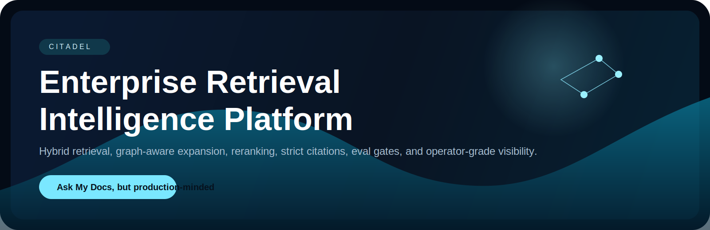

<p align="center">
  <strong>Enterprise Retrieval Intelligence Platform</strong><br/>
  Evidence-first document intelligence with hybrid retrieval, graph-aware expansion, reranking, strict citations, eval gates, and operator-grade visibility.
</p>

<p align="center">
  <a href="#why-citadel">Why</a> •
  <a href="#system-architecture">Architecture</a> •
  <a href="#query-lifecycle">Query Lifecycle</a> •
  <a href="#api-overview">API</a> •
  <a href="#local-setup">Run Local</a> •
  <a href="#tradeoffs">Tradeoffs</a>
</p>

<p align="center">
  
  
  
  
  
</p>

<p align="center">
  
  
  
  
  
</p>

> CITADEL is built around a simple contract: if the platform cannot show evidence, it should not pretend the answer is grounded.

## Why CITADEL

Internal knowledge systems usually collapse into two weak behaviors: vague semantic matching and confident uncited answers. That breaks down in the exact places enterprises care about most:

- incident policy questions need exact lexical recall and document lineage
- ownership answers depend on relationships across runbooks, ADRs, and standards
- governance-sensitive queries need an explicit insufficient-evidence mode
- operators need to inspect retrieval quality without tailing logs
- release confidence should come from eval gates, not intuition

CITADEL treats retrieval quality, visible evidence, and operational control as product requirements.

<table>
  <tr>
    <td width="33%">
      <strong>Hybrid retrieval</strong><br/>
      BM25 and dense retrieval are fused before graph expansion and reranking.
    </td>
    <td width="33%">
      <strong>Strict grounding</strong><br/>
      Answer sections render with citations or fall back to insufficient evidence.
    </td>
    <td width="33%">
      <strong>Operator visibility</strong><br/>
      Retrieval traces, provider posture, timings, and eval status are first-class UI surfaces.
    </td>
  </tr>
  <tr>
    <td width="33%">
      <strong>Real graph utility</strong><br/>
      Supersedes, ownership, policy, and reference edges can change which documents win.
    </td>
    <td width="33%">
      <strong>Eval-gated delivery</strong><br/>
      Retrieval recall, citation coverage, and unsupported claim rate are part of CI.
    </td>
    <td width="33%">
      <strong>Security-aware seams</strong><br/>
      Auditability, access-scope hooks, and bounded guardrails are built into the shape of the system.
    </td>
  </tr>
</table>

## Product Surfaces

Generated previews below are derived from the implemented layout and component structure in `apps/web`.

| Ask Workbench | Eval and Overview |
| --- | --- |
| 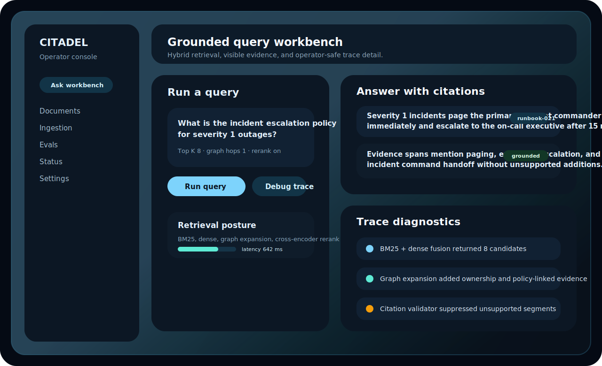 | 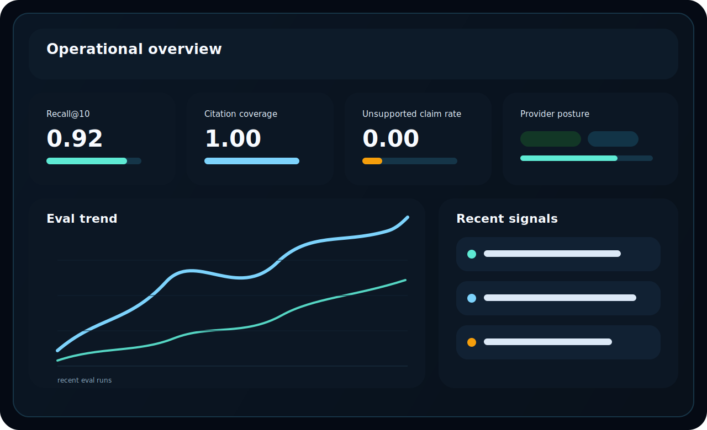 |

| Ingestion Console | Status and Provider Posture |
| --- | --- |
| 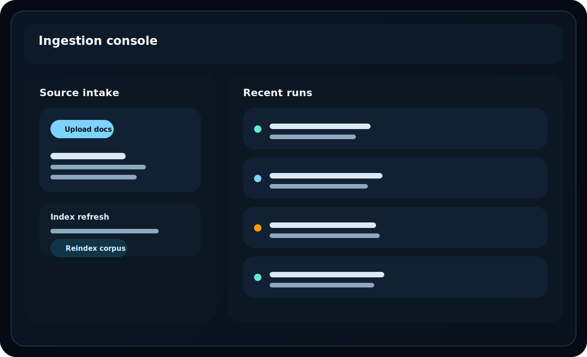 | 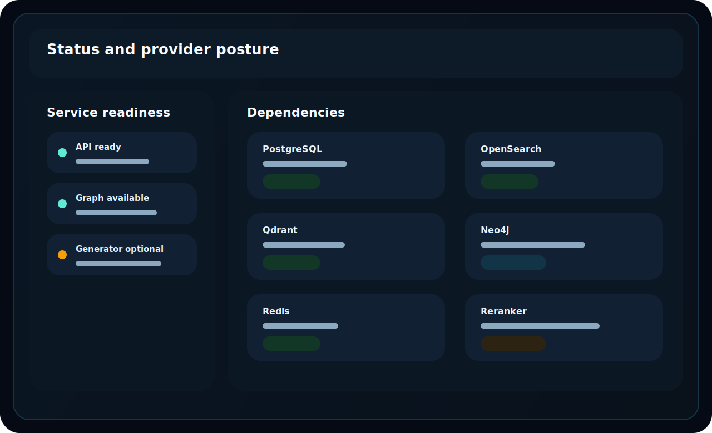 |

## System Architecture

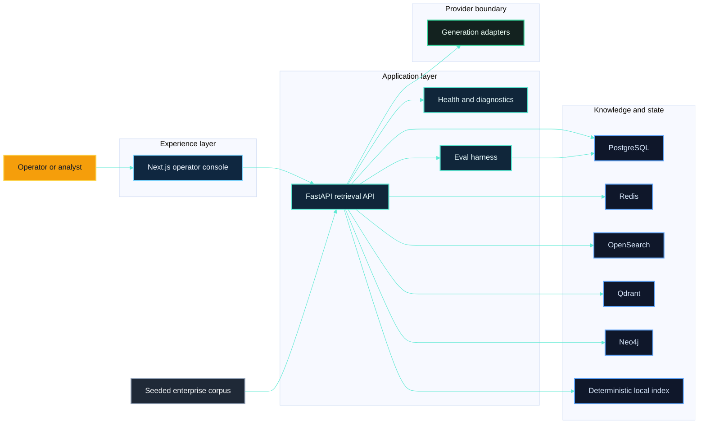

### Runtime Shape

- `apps/web` renders the operator-facing ask, document, ingestion, eval, status, and settings surfaces.
- `apps/api` owns ingestion, retrieval, graph expansion, answer assembly, health checks, evals, and persistence.
- `datasets/sample_corpus` contains a realistic enterprise corpus: runbooks, security playbooks, ADRs, onboarding manuals, privacy standards, and retention policy documents.
- Docker Compose provides the local topology for Postgres, Redis, OpenSearch, Qdrant, Neo4j, API, and web.
- A deterministic local retrieval index keeps the system useful when optional services are degraded and keeps CI deterministic.

## Query Lifecycle

```mermaid
%%{init: {'theme':'base','themeVariables': {'background':'#06101a','primaryTextColor':'#d8e7f7','lineColor':'#7dd3fc','fontFamily':'Arial','fontSize':'16px'}}}%%
flowchart LR
  Q["Analyst question"] --> N["Normalize and bounded rewrite"]
  N --> BM["BM25 retrieval"]
  N --> DE["Dense retrieval"]
  BM --> FU["Score fusion"]
  DE --> FU
  FU --> GX["Graph-aware expansion"]
  GX --> RR["Cross-encoder rerank"]
  RR --> PK["Context pack"]
  PK --> GA["Citation-bound answer assembly"]
  GA --> OUT["Answer, citations, trace, timings"]

  classDef intake fill:#172554,stroke:#93c5fd,color:#eff6ff,stroke-width:2px;
  classDef retrieve fill:#0f3b45,stroke:#5eead4,color:#ecfeff,stroke-width:2px;
  classDef rank fill:#2a1f4f,stroke:#c4b5fd,color:#f5f3ff,stroke-width:2px;
  classDef ground fill:#3a2814,stroke:#fbbf24,color:#fffbeb,stroke-width:2px;
  classDef output fill:#1f2937,stroke:#94a3b8,color:#f8fafc,stroke-width:2px;
  class Q,N intake;
  class BM,DE,FU,GX retrieve;
  class RR,PK rank;
  class GA ground;
  class OUT output;
```

## Ingestion Lifecycle

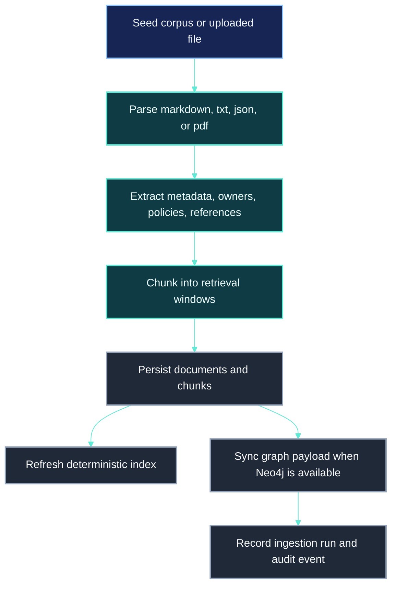

## Retrieval, Rerank, and Grounding Flow

```mermaid
%%{init: {'theme':'base','themeVariables': {'background':'#06101a','primaryTextColor':'#d8e7f7','lineColor':'#34d399','fontFamily':'Arial','fontSize':'16px'}}}%%
flowchart LR
  Q["Query"] --> LEX["Lexical match"]
  Q --> DENSE["Dense similarity"]
  LEX --> FUSE["Hybrid fusion"]
  DENSE --> FUSE
  FUSE --> GRAPH["Graph expansion boost"]
  GRAPH --> RERANK["Cross-encoder rerank"]
  RERANK --> EVID["Evidence selection"]
  EVID --> GROUND["Supported answer sections only"]
  GROUND --> MODE["Grounded or insufficient-evidence mode"]

  classDef start fill:#172554,stroke:#93c5fd,color:#eff6ff,stroke-width:2px;
  classDef hybrid fill:#123b3a,stroke:#34d399,color:#ecfdf5,stroke-width:2px;
  classDef rank fill:#0f2740,stroke:#7dd3fc,color:#eff6ff,stroke-width:2px;
  classDef ground fill:#3a2814,stroke:#fbbf24,color:#fffbeb,stroke-width:2px;
  class Q start;
  class LEX,DENSE,FUSE,GRAPH hybrid;
  class RERANK,EVID rank;
  class GROUND,MODE ground;
```

## Graph Expansion Path

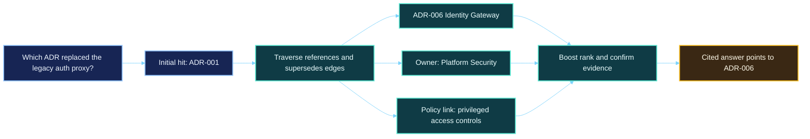

## Eval Pipeline and CI Gate

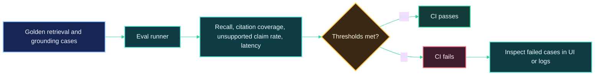

## Security and Governance Control Flow


## Retrieval Strategy

### Hybrid Retrieval

- **Lexical retrieval** catches exact policy names, doc IDs, ownership phrases, and operational language like `Severity 1`, `rollback`, or `privileged production access`.
- **Dense retrieval** recovers semantically related sources when the query and corpus use different wording.
- **Fusion** blends both channels before graph-aware expansion so the pipeline does not overfit to either exact wording or embedding similarity alone.

### Graph-Aware Expansion

The graph is useful because enterprise answers often sit behind relationships rather than pure similarity. CITADEL models and uses edges such as:

- `references`
- `supersedes`
- `owned_by`
- `governed_by`
- `mentions`

That matters for queries like "Which ADR replaced the legacy auth proxy?" where the right document is often the one that supersedes an older decision rather than the one that shares the most words with the query.

### Reranking

The reranker uses a local cross-encoder when available. If that model is unavailable, the system falls back to deterministic fusion ordering and surfaces that degraded posture in provider status rather than silently pretending full ranking fidelity.

## Citation Enforcement

CITADEL keeps grounded delivery strict:

- answer sections are assembled only from retrieved evidence windows
- every rendered section carries citations
- unsupported sections are suppressed instead of shown as grounded
- insufficient evidence is a first-class response mode
- the Ask surface shows chunk evidence, source IDs, graph notes, and timings for the same run

This is intentionally stricter than a freeform answer generator. Fluency loses to provenance on purpose.

## Agentic Orchestration

CITADEL avoids theatrical "autonomous agent" framing. The current orchestration is bounded and explicit:

- query rewriting is retrieval-only and deterministic
- graph expansion is limited by hop count
- retrieval debugging exposes graph effects and policy notes
- open-ended tool execution is not exposed from the ask surface

The codebase leaves room for future workflow engines or LangGraph-style state nodes, but the current baseline keeps control logic inspectable and finite.

## Evaluation and Observability

### Eval posture

Seeded eval datasets live in `datasets/evals/` and include:

- retrieval target checks
- grounding checks
- disallowed claim checks

Thresholds currently enforced in the API configuration:

- `retrieval_recall_at_10 >= 0.80`
- `citation_coverage == 1.00`
- `unsupported_claim_rate <= 0.05`

### Operator visibility

- provider health is persisted in the relational store
- retrieval stage timings are returned per query
- eval runs are stored and surfaced in the UI
- audit events are persisted for retrieval and ingestion actions

## Security, Governance, and Responsible AI Posture

This repository does **not** claim certification or compliance. It does implement credible seams and documentation for responsible deployment.

### Included design controls

- RBAC-ready actor model
- source-level access scope field on documents
- audit event persistence
- secret separation via environment configuration
- provider visibility without credential leakage
- bounded guardrail handling for unsafe queries
- evidence-first response posture for grounding-sensitive use cases

### Framework awareness

- **NIST AI RMF**: governance, measurement, and operator visibility are built into the runtime
- **ISO 42001 awareness**: control notes, evaluation processes, and monitoring seams exist in the repo
- **EU AI Act awareness**: provenance and bounded output matter more than model theatrics
- **SOC 2 mindset**: traceability, access boundaries, and change visibility are treated seriously
- **GDPR / HIPAA extensibility mindset**: privacy-aware storage and access hooks are included without pretending to be compliance out of the box

See:

- [Architecture overview](docs/architecture/overview.md)
- [Governance control notes](docs/governance/control-notes.md)
- [Threat model notes](docs/threat-model/maestro-linddun.md)
- [System tradeoffs](docs/decisions/system-tradeoffs.md)

## API Overview

| Route | Purpose |
| --- | --- |
| `GET /health` | Base service health |
| `GET /health/dependencies` | Dependency health for database, cache, search, graph, reranker, and generation posture |
| `GET /health/readiness` | Readiness and indexed-document signal |
| `POST /api/v1/chat/query` | Grounded query execution |
| `POST /api/v1/chat/query/debug` | Query execution with trace visibility |
| `POST /api/v1/ingest/upload` | Upload and ingest a file |
| `POST /api/v1/ingest/reindex` | Rebuild indexes from the corpus |
| `GET /api/v1/documents` | Document inventory |
| `GET /api/v1/documents/{id}` | Document metadata and chunks |
| `GET /api/v1/documents/{id}/chunks` | Chunk list for source inspection |
| `GET /api/v1/retrieval/runs/{id}` | Retrieval run detail |
| `GET /api/v1/evals` | Eval history |
| `POST /api/v1/evals/run` | Execute evaluation profile |
| `GET /api/v1/evals/{id}` | Eval detail |
| `GET /api/v1/providers` | Provider and dependency posture |
| `GET /api/v1/config/public` | Safe public runtime config |

## Sample Prompts

- What is the incident escalation policy for severity 1 outages?
- Which team owns the deployment rollback runbook?
- How does contractor onboarding differ from employee onboarding?
- Which ADR replaced the legacy auth proxy?
- What documents mention data retention exceptions?
- Which policy governs privileged production access?

## Local Setup

### Prerequisites

- Docker
- Python 3.11+
- Node 20+

### Bootstrap

```bash
cp .env.example .env
./scripts/bootstrap/bootstrap.sh
```

### Run with Docker Compose

```bash
docker compose up --build
```

Then open:

- Web UI: `http://localhost:3000`
- API docs: `http://localhost:8000/docs`

### Useful local commands

```bash
make api-test
make eval
make web-build
make seed
```

## Repository Shape

```text
citadel/
├── apps/
│   ├── api/         # FastAPI app, retrieval pipeline, evals, tests, migrations
│   └── web/         # Next.js App Router UI
├── datasets/        # Seed corpus and eval cases
├── docs/            # Architecture, governance, threat model, runbooks, assets
├── infra/           # Dockerfiles, CI workflow, terraform reference seams
├── packages/        # Shared UI, config, TS types, schemas, prompt assets
└── scripts/         # Bootstrap and runtime helper scripts
```

## Cloud Portability Notes

The implemented local path is Docker Compose first. The repo also includes cloud mapping notes for:

- AWS
- Azure
- GCP

Those notes are intentionally reference-grade, not fake multi-cloud IaC claims. See `infra/terraform/environments/*`.

## Tradeoffs

| Tradeoff | Decision |
| --- | --- |
| OpenSearch + vector + graph complexity vs simplicity | Keep the seams visible because enterprise retrieval quality often needs all three, while maintaining a deterministic local fallback for CI and degraded mode |
| Local-first models vs managed providers | Default to deterministic extractive assembly; provider adapters are visible but not required for the grounded baseline path |
| Workflow engine vs handwritten orchestration | Keep the current orchestration explicit and bounded; there is not enough payoff yet to justify a heavier agent graph runtime |
| Citation strictness vs answer fluency | Favor provenance and insufficient-evidence handling over smoother but riskier freeform output |
| Eval gates vs developer velocity | Let eval thresholds block regressions; quality gates are part of the product contract |
| Graph expansion vs latency budget | Bound graph hops and surface timings directly in the response |
| Docker Compose vs production orchestration depth | Optimize for a credible local stack while keeping cloud seams documented instead of pretending production IaC is finished |
| Governance overhead vs shipping speed | Build governance hooks into the base architecture so they do not become retrofits later |

## Roadmap

The baseline is complete enough to run and inspect locally. The next serious upgrades would be:

1. Service-mode indexing and retrieval adapters wired fully to OpenSearch and Qdrant in the live request path.
2. Provider-backed structured generation with citation token validation, not just extractive assembly.
3. Real auth and document-level access enforcement at query time.
4. Richer eval suites with adversarial retrieval and permission-boundary cases.
5. Experiment tracking integration for retrieval tuning and model comparisons.

## License

Apache 2.0
